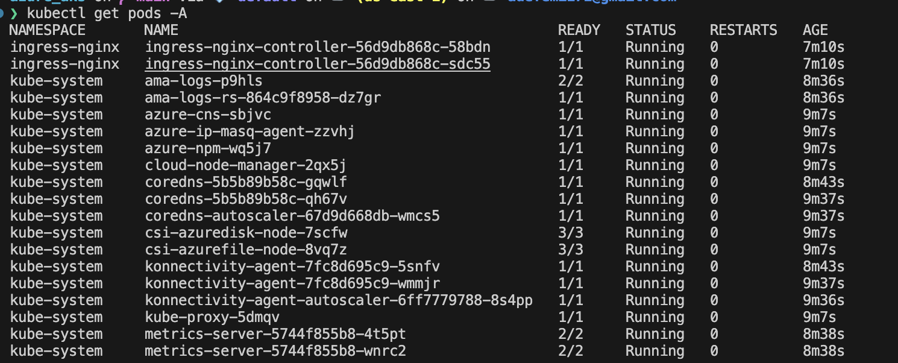

# Azure AKS Terraform Project

This Terraform project deploys an Azure Kubernetes Service (AKS) cluster with default networking configuration using a modular approach.

## Prerequisites

1. [Terraform](https://www.terraform.io/downloads.html) >= 1.0
2. [Azure CLI](https://docs.microsoft.com/en-us/cli/azure/install-azure-cli) >= 2.40
3. An Azure subscription with sufficient permissions
4. Azure CLI authenticated (`az login`)

## To Set up on your Azure Account

- Log in to your azure account using azure CLI by running `az login` in your terminal.
- Set the subscription you want to use by running `az account set --subscription "<subscription_id>"`.
- Clone this repository to your local machine:

```bash
git clone git@github.com:samuel-init/azure-aks.git
cd azure-aks
```

- Configure your Terraform variables by copying `terraform.tfvars.example` to `terraform.tfvars` and updating the values as needed.
- Initialize the Terraform working directory:

```bash
terraform init
```

- Review the Terraform plan to see the resources that will be created:
  
```bash
terraform plan
```

- Apply the Terraform configuration to create the resources:

```bash
terraform apply
```

- Confirm the apply action when prompted.

### Configure kubectl to connect to your AKS cluster

- After the AKS cluster is created, configure `kubectl` to connect to your AKS cluster by running:

```bash
az aks get-credentials --resource-group <resource_group_name> --name <cluster_name>
```

- Verify the connection by running:

```bash
kubectl get po -A
```



## Cleanup

To delete all resources created by this Terraform project, run:

```bash
terraform destroy
```
